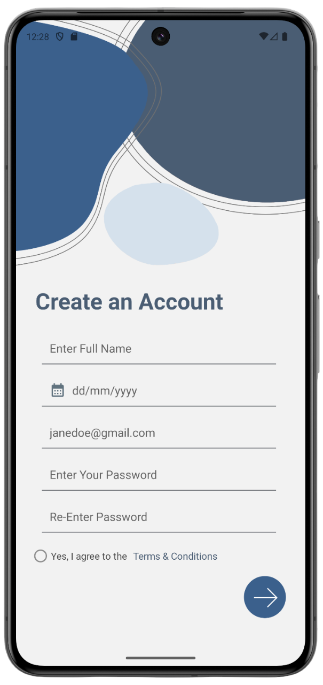

# Care Companion


Android application designed to support and assist individuals, particularly those who need help managing healthcare information. The app aims to provide a secure, organised way to store and access essential medical data, helping users manage their health more effectively and ensuring privacy through robust security features.


## Features

**Secure Medical ID and Profile Storage:** Store personal and medical information safely using Firebase, protected with stringent security rules to ensure only authorised access.

**Full Data Management:** Supports Create, Read, Update, and Delete (CRUD) operations for users to manage their healthcare records conveniently within the app.

**Secure Authentication:** Includes email-password and Google sign-in options for a secure login experience, with account recovery and deletion features for enhanced user control.

**Easy Onboarding:** Provides a straightforward, user-friendly onboarding process, making setup quick and simple for users of all backgrounds.


## Installation

To get started with CareCompanion, follow these steps:

**1) Clone the repository:**

```bash
git clone https://github.com/yourusername/CareCompanion.git
cd CareCompanion
```
**2) Open the project in Android Studio:**

Launch Android Studio and select "Open an existing project". Navigate to the CareCompanion directory and click "OK".

**3) Build the project:**

Ensure you have the latest version of Android Studio and the Android SDK installed. Build the project to resolve dependencies.

**4) Run the app on an emulator or physical device:**

Connect your Android device or start an emulator, then click the "Run" button in Android Studio.


## Screenshots

|  |  |  |
|------------------------------------------|------------------------------------------|------------------------------------------|
| **Login Page**                           | **Registration Page**                           | **Reseting password**                           |

|  |  |  |
|------------------------------------------|------------------------------------------|------------------------------------------|
| **Home page**                           | **Medical ID**                           | **Settings Page**                           |

|  |  |
|------------------------------------------|------------------------------------------|
| **Calendar**                           |   **Chat Bot**                          |


## Tech Stack

**Client**

_Language: Java_

_UI Design: XML__

_Authentication: Email-password and Google authentication_

_Development Environment: Android Studio_

**Server**

_Backend: Firebase_

_Database: Firestore, configured with advanced security rules to ensure data privacy_

_Storage: Firebase Storage_

## Contributing

Contributions are welcome! Please see [CONTRIBUTING.md](https://github.com/amina-haq/CareCompanion/blob/master/CONTRIBUTING.md) for guidelines on how to get involved.
